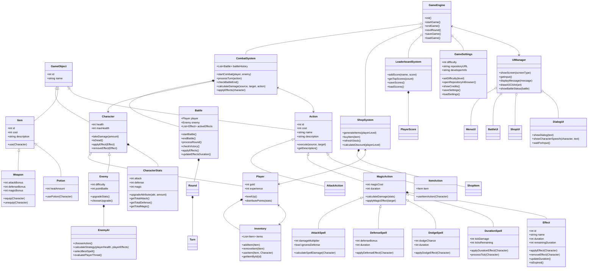

```mermaid
classDiagram
    GameObject <|-- Character
    GameObject <|-- Item
    GameObject <|-- Action
    
    Character <|-- Player
    Character <|-- Enemy
    
    Item <|-- Weapon
    Item <|-- Potion
    
    Action <|-- AttackAction
    Action <|-- MagicAction
    Action <|-- ItemAction
    
    MagicAction <|-- AttackSpell
    MagicAction <|-- DefenseSpell
    MagicAction <|-- DodgeSpell
    MagicAction <|-- DurationSpell
    
    GameEngine o-- CombatSystem
    GameEngine o-- ShopSystem
    GameEngine o-- LeaderboardSystem
    GameEngine o-- GameSettings
    
    UIManager o-- MenuUI
    UIManager o-- BattleUI
    UIManager o-- ShopUI
    UIManager o-- DialogUI
    
    Player *-- Inventory
    Character *-- CharacterStats
    Enemy *-- EnemyAI
    
    ShopSystem *-- ShopItem
    LeaderboardSystem *-- PlayerScore
    
    CombatSystem *-- Battle
    Battle *-- Round
    Round *-- Turn
    
    MagicAction *-- Effect
    
    GameEngine <--> UIManager
    Player <--> Inventory
    CombatSystem <--> Character
    CombatSystem <--> Action
    ShopSystem <--> Player
    
    class GameObject {
        +int id
        +string name
    }
    
    class Character {
        +int health
        +int maxHealth
        +takeDamage(amount)
        +isDead()
        +applyEffect(Effect)
        +removeEffect(Effect)
    }
    
    class Player {
        +int gold
        +int experience
        +levelUp()
        +distributePoints(stats)
    }
    
    class Enemy {
        +int difficulty
        +int pointBattle
        +upgradeStats()
        +chooseUpgrade()
    }
    
    class Item {
        +int id
        +int cost
        +string description
        +use(Character)
    }
    
    class Weapon {
        +int attackBonus
        +int defenseBonus
        +int magicBonus
        +equip(Character)
        +unequip(Character)
    }
    
    class Potion {
        +int healAmount
        +usePotion(Character)
    }
    
    class CharacterStats {
        +int attack
        +int defense
        +int magic
        +upgradeAttribute(attr, amount)
        +getTotalAttack()
        +getTotalDefense()
        +getTotalMagic()
    }
    
    class Inventory {
        +List~Item~ items
        +addItem(Item)
        +removeItem(Item)
        +useItem(Item, Character)
        +getItemById(id)
    }
    
    class Action {
        +int id
        +int cost
        +string name
        +string description
        +execute(source, target)
        +getDescription()
    }
    
    class ItemAction {
        +Item item
        +useItemAction(Character)
    }
    
    class MagicAction {
        +int magicCost
        +int duration
        +calculateDamage(stats)
        +applyMagicEffect(target)
    }
    
    class AttackSpell {
        +int damageMultiplier
        +bool ignoresDefense
        +calculateSpellDamage(Character)
    }
    
    class DefenseSpell {
        +int defenseBonus
        +int duration
        +applyDefenseEffect(Character)
    }
    
    class DodgeSpell {
        +int dodgeChance
        +int duration
        +applyDodgeEffect(Character)
    }
    
    class DurationSpell {
        +int tickDamage
        +int ticksRemaining
        +applyDurationEffect(Character)
        +processTick(Character)
    }
    
    class Effect {
        +int id
        +string name
        +int duration
        +int remainingDuration
        +applyEffect(Character)
        +removeEffect(Character)
        +updateDuration()
        +isExpired()
    }
    
    class Battle {
        +Player player
        +Enemy enemy
        +List~Effect~ activeEffects
        +startBattle()
        +endBattle()
        +processRound()
        +checkVictory()
        +applyEffects()
        +updateEffectsDuration()
    }
    
    class CombatSystem {
        +List~Battle~ battleHistory
        +startCombat(player, enemy)
        +processTurn(action)
        +checkBattleEnd()
        +calculateDamage(source, target, action)
        +applyEffects(character)
    }
    
    class GameEngine {
        +init()
        +startGame()
        +endGame()
        +nextRound()
        +saveGame()
        +loadGame()
    }
    
    class UIManager {
        +showScreen(screenType)
        +getInput()
        +displayMessage(message)
        +drawASCIIArt(art)
        +showBattleStatus(battle)
    }
    
    class DialogUI {
        +showDialog(text)
        +showCharacterSpeech(character, text)
        +waitForInput()
    }
    
    class EnemyAI {
        +chooseAction()
        +calculateStrategy(playerHealth, playerEffects)
        +selectBestSpell()
        +evaluatePlayerThreat()
    }
    
    class ShopSystem {
        +generateItems(playerLevel)
        +buyItem(item)
        +refreshStock()
        +calculateDiscount(playerLevel)
    }
    
    class LeaderboardSystem {
        +addScore(name, score)
        +getTopScores(count)
        +saveScores()
        +loadScores()
    }
    
    class GameSettings {
        +int difficulty
        +string repositoryURL
        +string developerInfo
        +setDifficulty(level)
        +openRepositoryInBrowser()
        +showCredits()
        +saveSettings()
        +loadSettings()
    }
```
