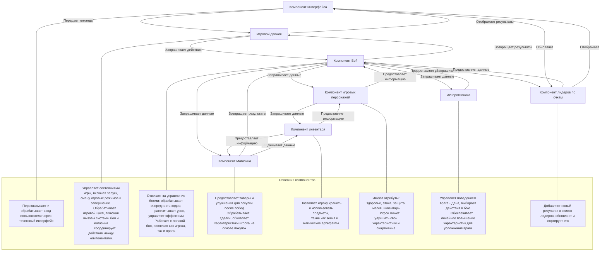

```mermaid
graph TD
    UI[Компонент Интерфейса] --> |Передает команды| Engine[Игровой движок]
    Engine --> |Отображает результаты| UI
    
    Engine --> |Запрашивает действия| Combat[Компонент Бой]
    Combat --> |Возвращает результаты| Engine
    
    Combat --> |Запрашивает данные| Characters[Компонент игровых персонажей]
    Characters --> |Предоставляет информацию| Combat
    
    Combat --> |Запрашивает данные| AI[ИИ противника]
    AI --> |Предоставляет действия| Combat
    
    Combat --> |Запрашивает данные| Leaderboard[Компонент лидеров по очкам]
    Leaderboard --> |Предоставляет данные| Combat
    
    Leaderboard --> |Отображает| UI
    UI --> |Обновляет| Leaderboard
    
    Combat --> |Запрашивает данные| Shop[Компонент Магазина]
    Shop --> |Возвращает результаты| Combat
    
    Characters --> |Запрашивает данные| Inventory[Компонент инвентаря]
    Inventory --> |Предоставляет информацию| Characters
    
    Shop --> |Запрашивает данные| Inventory
    Inventory --> |Предоставляет информацию| Shop
    
    subgraph "Описания компонентов"
        UI_desc["Перехватывает и обрабатывает ввод пользователя через текстовый интерфейс"]
        Engine_desc["Управляет состояниями игры, включая запуск, смену игровых режимов и завершение. 
        Обрабатывает игровой цикл, включая вызовы системы боя и магазина.
        Координирует действия между компонентами."]
        Combat_desc["Отвечает за управление боями: обрабатывает очередность ходов, 
        рассчитывает урон, управляет эффектами.
        Работает с логикой боя, вовлекая как игрока, так и врага."]
        Shop_desc["Предоставляет товары и улучшения для покупки после побед.
        Обрабатывает сделки, обновляет характеристики игрока на основе покупок."]
        Inventory_desc["Позволяет игроку хранить и использовать предметы, 
        такие как зелья и магические артефакты."]
        Characters_desc["Имеют атрибуты: здоровье, атака, защита, магия, инвентарь.
        Игрок может улучшать свои характеристики и снаряжение."]
        AI_desc["Управляет поведением врага - Дена, выбирает действия в бою.
        Обеспечивает линейное повышение характеристик для усложнения врага."]
        Leaderboard_desc["Добавляет новый результат в список лидеров, обновляет и сортирует его"]
    end
    
    UI --- UI_desc
    Engine --- Engine_desc
    Combat --- Combat_desc
    Shop --- Shop_desc
    Inventory --- Inventory_desc
    Characters --- Characters_desc
    AI --- AI_desc
    Leaderboard --- Leaderboard_desc
```
