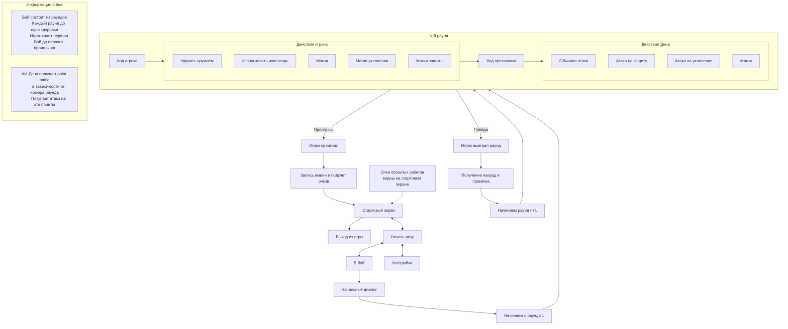

```mermaid
flowchart TD
    Start[Стартовый экран] --> Exit[Выход из игры]
    Start <--> Begin[Начать игру]
    Begin <--> Combat[В бой]
    Begin <--> Settings[Настройки]
    Combat --> Dialog[Начальный диалог]
    Dialog --> Round1[Начинаем с раунда 1]
    
    subgraph Round[N-й раунд]
        PlayerTurn[Ход игрока] --> Actions
        
        subgraph Actions[Действия игрока]
            Weapon[Ударить оружием]
            Inventory[Использовать инвентарь]
            Magic[Магия]
            Dodge[Магия уклонения]
            Defense[Магия защиты]
        end
        
        Actions --> EnemyTurn[Ход противника]
        
        subgraph EnemyActions[Действия Дена]
            NormalAtk[Обычная атака]
            DefenseAtk[Атака на защиту]
            DodgeAtk[Атака на уклонение]
            EnemyMagic[Магия]
        end
        
        EnemyTurn --> EnemyActions
    end
    
    Round1 --> Round
    
    Round --> |Проигрыш| Lose[Игрок проиграл]
    Round --> |Победа| Win[Игрок выиграл раунд]
    
    Lose --> Score[Запись имени и подсчет очков]
    Score --> Start
    
    Win --> Rewards[Получение наград и прокачка]
    Rewards --> NextRound[Начинаем раунд n+1]
    NextRound --> Round
    
    Note1[Очки прошлых забегов\nвидны на стартовом экране] -.-> Start
    
    subgraph Info[Информация о бое]
        BattleInfo[Бой состоит из раундов
        Каждый раунд до нуля здоровья
        Игрок ходит первым
        Бой до первого проигрыша]
        
        AIInfo[ИИ Дена получает point battle
        в зависимости от номера раунда
        Покупает атаки на эти поинты]
    end
```
